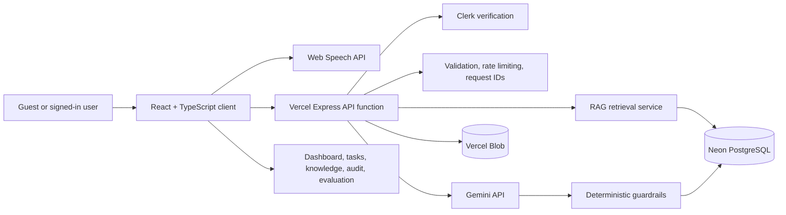
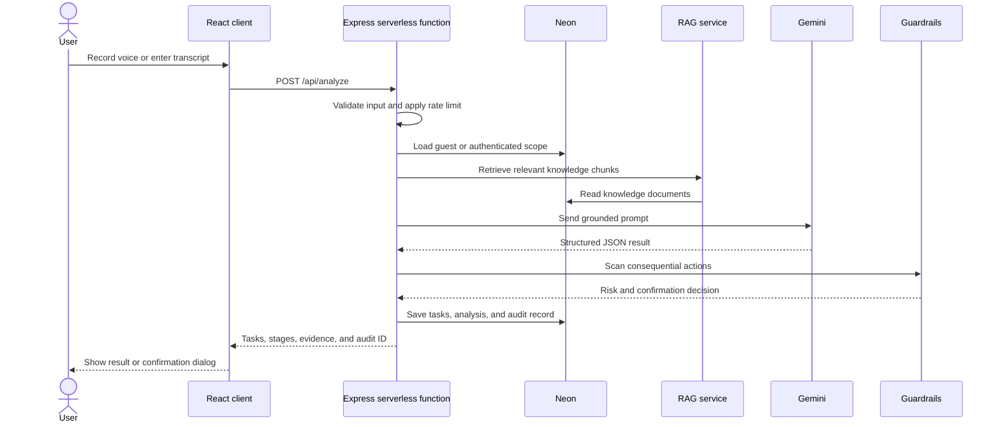
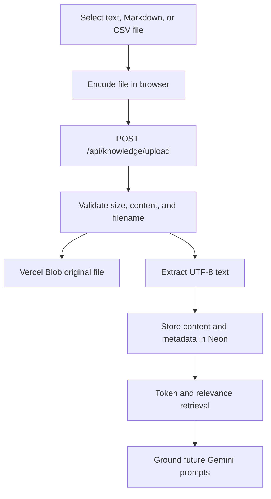
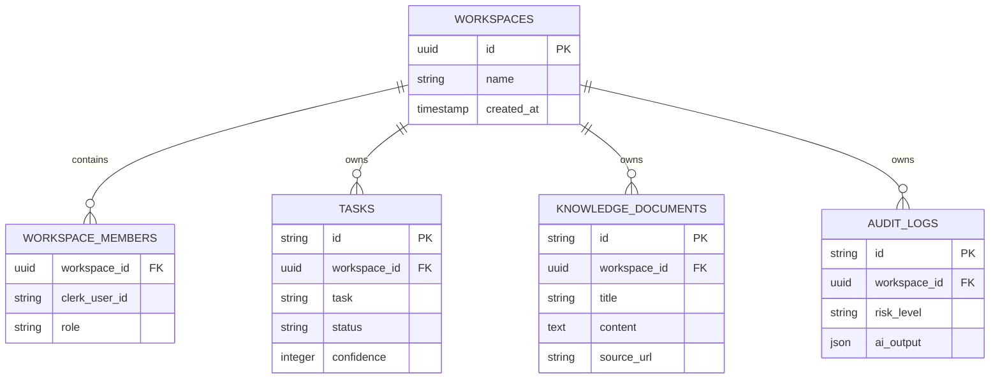

# AI Voice-to-Action Assistant

> A responsible AI workspace that converts voice notes and meeting transcripts into structured, explainable, and auditable tasks using Gemini, RAG grounding, deterministic safety guardrails, Clerk identity scopes, Neon persistence, Vercel Blob uploads, and Vercel serverless deployment.

---

## Table of Contents
1. [Overview](#overview)
2. [How It Works](#how-it-works)
3. [Core Architecture & Capabilities](#core-architecture--capabilities)
   - [1. Real-Time Speech Recognition & Microphone Permissions](#1-real-time-speech-recognition--microphone-permissions)
   - [2. Multi-Stage Reasoning Workflow (ReAct Framework)](#2-multi-stage-reasoning-workflow-react-framework)
   - [3. Grounded Context & Internal Knowledge Base](#3-grounded-context--internal-knowledge-base)
   - [4. Guardrails & Consequential Action Detection](#4-guardrails--consequential-action-detection)
   - [5. Task Management System](#5-task-management-system)
   - [6. Audit Trail & Compliance Logging](#6-audit-trail--compliance-logging)
   - [7. Benchmark Evaluation Suite (ReAct vs. Baseline)](#7-benchmark-evaluation-suite-react-vs-baseline)
4. [Technology Stack](#technology-stack)
5. [High-Level Architecture](#high-level-architecture)
6. [System Architecture](#system-architecture)
7. [API Reference](#api-reference)
7. [Getting Started & Local Development](#getting-started--local-development)
8. [Configuration & Environment Variables](#configuration--environment-variables)
9. [Safety & Security Highlights](#safety--security-highlights)
10. [Vercel Deployment](#vercel-deployment)
11. [Database Design](#database-design)
12. [Limitations and Roadmap](#limitations-and-roadmap)
13. [Resume-Ready Project Summary](#resume-ready-project-summary)

---

## Overview

In day-to-day engineering and product operations, action items from standups, planning calls, or quick voice memos often get lost in ambiguous language, unassigned owners, or missing deadlines. 

The **AI Voice-to-Action Assistant** bridges this gap:
- **Listens** to real-time speech or accepts written transcripts.
- **Understands** context using internal team directories, project documents, and role definitions.
- **Structures** speech into granular tasks with owners, deadlines, priority levels, confidence scores, and verbatim evidence.
- **Protects** against unauthorized or consequential actions (e.g. money transfers, account deletions, credential leaks) through server-authoritative guardrails.
- **Audits** every extraction with full model traceability, execution latencies, and human decision records.

---

## How It Works

```
[User Audio / Transcript]
           │
           ▼
[Microphone Permission Check & Web Speech API]
           │
           ▼
[Section 9: Input Validation & Sanitization]
           │
           ▼
[Section 22: Context Retrieval & Document Grounding]
           │
           ▼
[ReAct Multi-Stage Reasoning (Gemini API)]
 ├─ Stage 1: Input received
 ├─ Stage 2: Integrity & length validation
 ├─ Stage 3: Semantic understanding & intent detection
 ├─ Stage 4: Grounded context matching
 ├─ Stage 5: Structured task extraction & synthesis
 ├─ Stage 6: Safety check & consequential action scan
 └─ Stage 7: Schema verification & presentation
           │
           ▼
[Section 15 & 16: Guardrail Evaluation]
 ├─ Low Risk    ──► Direct display in Task Board & Dashboard
 └─ High Risk   ──► Halts execution & triggers Human Confirmation Dialog
           │
           ▼
[Section 23: Complete Audit Log Persisted to Storage]
```

1. **Permission Check & Capture**: When you click the microphone button, the app explicitly asks for microphone permission via both the Web Audio/MediaDevices API and a dedicated confirmation prompt. Speech is transcribed in real-time.
2. **Context Grounding**: The assistant scans internal project files (e.g., `team_members.txt`, `project_guidelines.txt`) to correctly associate ambiguous references like *"I"* or *"assign frontend to the lead"* to the correct team member (e.g., Siddharth Kumar, Rahul Sharma).
3. **Structured Extraction**: Gemini extracts action items, estimates realistic priority and deadline metadata, and isolates specific assumptions and uncertainties.
4. **Safety & Risk Assessment**: If high-risk verbs (e.g., *transfer funds*, *delete table*, *reveal password*) are present, the app flags the output as `HIGH` or `MEDIUM` risk, generates a pending action card, and halts any downstream automation until an authorized human user explicitly clicks **Confirm** or **Cancel**.
5. **Continuous Auditability**: Every single prompt, raw transcript, token response, confidence score, and confirmation state is permanently stored in the audit registry.

---

## Core Architecture & Capabilities

### 1. Real-Time Speech Recognition & Microphone Permissions
- **User-Consent Flow**: Explicitly requests microphone authorization (`navigator.mediaDevices.getUserMedia` and Web Speech API).
- **Graceful Fallbacks**: If access is denied or unavailable, users are clearly informed how to enable permissions or switch seamlessly to manual text input.
- **Live Interim Feedback**: Words stream directly onto the screen as they are spoken, allowing users to review and manually edit before triggering analysis.

### 2. Multi-Stage Reasoning Workflow (ReAct Framework)
Unlike simple zero-shot prompts, the assistant utilizes a structured Reason + Act (ReAct) workflow:
- **Observation & Decomposition**: Analyzes sentences, entities, and temporal markers (e.g., *"by Friday"*, *"next Tuesday"*).
- **Assumptions vs. Uncertainties**: Explicitly lists what was assumed (e.g., current sprint dates) vs. what remains ambiguous (e.g., unstated meeting times).
- **Verbatim Evidence Linking**: Each generated task links directly back to the exact quote in the transcript that justified it.

### 3. Grounded Context & Internal Knowledge Base
- **Document Management**: Built-in Knowledge Base stores project guidelines, team member roles, and company policies.
- **Dynamic Retrieval**: Queries are evaluated against documents to retrieve relevant excerpts with confidence relevance scores.
- **Entity Disambiguation**: Resolves pronouns and roles to real names and titles without hallucination.

### 4. Guardrails & Consequential Action Detection
- **Multi-Category Scanning**:
  - **Financial**: Money transfers, payouts, vendor payments, disbursements.
  - **Deletion / Destruction**: Database drops, user purges, log deletions, file removals.
  - **Security & Access**: Credential retrieval, role elevation, private keys, admin grants.
  - **External Communication**: Broadcast emails, newsletters, contract dispatch.
- **Server-Authoritative Enforcement**: Even if client inputs attempt to bypass the model, backend guardrail rules enforce `HIGH` risk tagging and mandatory confirmation.

### 5. Task Management System
- **Interactive Kanban / Table**: Filter tasks by status (`Pending`, `In Progress`, `Completed`), priority, or owner.
- **Inline Editing & Quick Add**: Modify task descriptions, reassign owners, or set deadlines on the fly.
- **Export Capabilities**: Export entire task lists or individual analyses to structured JSON and CSV.

### 6. Audit Trail & Compliance Logging
- **Immutable Log Store**: Logs the exact timestamp, prompt version, input source (`voice`, `text`, `demo`), model used, execution duration, and full AI payload.
- **Confirmation State Tracking**: Tracks whether proposed high-risk actions were `CONFIRMED`, `CANCELLED`, or marked `NOT_REQUIRED`.
- **Deep Inspection Drawer**: Inspect raw JSON payloads, reasoning stages, and context grounding scores for any past transaction.

### 7. Benchmark Evaluation Suite (ReAct vs. Baseline)
- **Side-by-Side Comparison**: Pre-configured test cases evaluate the ReAct reasoning pipeline against naive single-prompt baseline extraction.
- **Metrics Evaluated**:
  - Task Extraction Accuracy (%)
  - Ambiguity Detection Rate (%)
  - Guardrail & Safety Compliance (%)
  - Owner Attribution Precision (%)

---

## Technology Stack

- **Frontend**:
  - React 19 with TypeScript
  - Tailwind CSS (v4)
  - Lucide React (Icons)
  - Motion (Fluid animations)
  - Web Speech API & MediaDevices API
- **Backend**:
  - Express 4.x running as a Vercel serverless function
  - `@google/genai` for Gemini analysis and refinement
  - Neon PostgreSQL for hosted persistence and user-scoped state
  - Vercel Blob for original knowledge-base files
  - Clerk for optional authentication and verified identity scopes
  - Local JSON persistence fallback for development
- **Build and deployment**:
  - Vite 6 + esbuild
  - Vercel static output plus `/api` serverless routing
  - TypeScript checks and Node-based guardrail regression tests

---

## High-Level Architecture



## Analysis Request Flow



## Upload and RAG Flow



## System Architecture

```
/
├── server.ts                  # Express server entry point & API route handlers
├── server/
│   ├── db.ts                  # JSON file storage manager (tasks, analyses, audit logs)
│   ├── gemini.ts              # Gemini API service, prompt engineering & ReAct parsing
│   └── guardrails.ts          # Server-side safety guardrails & consequential action scanner
├── src/
│   ├── App.tsx                # Main application state, navigation, and API coordination
│   ├── main.tsx               # Client React DOM entry point
│   ├── types.ts               # Shared TypeScript schemas, interfaces, and enums
│   ├── components/
│   │   ├── Navigation.tsx     # App header and tab switcher
│   │   ├── VoiceRecorder.tsx  # Mic permissions, Web Speech recording & interim transcript
│   │   ├── ProcessingWorkflow.tsx # Visual progress stepper for reasoning stages
│   │   ├── ResultDisplay.tsx  # Task cards, evidence accordion, refinement & export
│   │   ├── ConfirmationDialog.tsx # High-risk human confirmation modal
│   │   └── GroundedSourceCard.tsx # Grounded knowledge base citations
│   └── pages/
│       ├── DashboardPage.tsx      # Overview metrics & synchronized recent analyses
│       ├── VoiceAssistantPage.tsx # Core voice & text input interface
│       ├── TasksPage.tsx          # Task management, filters & status updates
│       ├── KnowledgeBasePage.tsx  # Internal document search & management
│       ├── AuditLogsPage.tsx      # Full audit history & inspection
│       ├── EvaluationPage.tsx     # ReAct vs. Baseline benchmark runner
│       └── SettingsPage.tsx       # Model selection, grounding toggles & system diagnostics
└── metadata.json              # Platform capabilities and microphone permissions
```

---

## API Reference

| Endpoint | Method | Description |
| :--- | :---: | :--- |
| `/api/health` | `GET` | API, model, storage, and system status |
| `/api/stats` | `GET` | Dashboard metrics |
| `/api/analyze` | `POST` | Analyze a transcript with grounded AI |
| `/api/refine` | `POST` | Refine an existing AI result |
| `/api/execute-action` | `POST` | Record confirmation or cancellation; no external side effect |
| `/api/tasks` | `GET/POST` | List or create tasks |
| `/api/tasks/:id` | `PATCH/DELETE` | Update or delete a task |
| `/api/analyses` | `GET` | List recent analyses |
| `/api/audit-logs` | `GET/DELETE` | Read or clear audit records |
| `/api/audit-logs/:id/action` | `POST` | Record a confirmation decision |
| `/api/knowledge` | `GET/POST` | List or create knowledge documents |
| `/api/knowledge/upload` | `POST` | Upload a text-readable file to Blob and Neon |
| `/api/knowledge/:id` | `DELETE` | Delete a knowledge document |
| `/api/knowledge/search` | `POST` | Search grounded knowledge chunks |
| `/api/evaluation/cases` | `GET` | List benchmark cases |
| `/api/evaluate` | `POST` | Run a benchmark comparison |
| `/api/settings` | `GET/PATCH` | Read or update assistant settings |
| `/api/reset` | `POST` | Restore demo data after explicit confirmation |

---

## Getting Started & Local Development

### Prerequisites
- Node.js 20+
- npm or yarn

### Installation
1. Clone the repository or open in Google AI Studio.
2. Install dependencies:
   ```bash
   npm install
   ```

3. Configure environment variables (see below).

4. Start the development server:
   ```bash
   npm run dev
   ```
   The application will be accessible at `http://localhost:3000`.

5. Build for production:
   ```bash
   npm run build
   npm start
   ```

---

---

## Safety & Security Highlights

1. **Human-in-the-Loop Safeguards**: High-risk financial, security, or data modification tasks cannot execute autonomously. They generate an interactive confirmation dialog with audit logging.
2. **Audio Privacy**: Speech recognition is executed locally via browser APIs. Audio streams are terminated immediately upon stopping recording.
3. **Defense-in-Depth Risk Analysis**: High-risk detection uses both deep semantic LLM evaluation and deterministic regular-expression rule matching.
4. **Transparent Citations**: Every piece of extracted metadata cites its source sentence from the user's transcript or knowledge base document.

## Vercel Deployment

1. Import the repository into Vercel.
2. Keep the Vite framework preset or allow automatic detection.
3. Add the environment variables below.
4. Deploy from the project root.
5. Confirm `/api/health` reports `storage: "neon"`.
6. Test guest analysis, sign-in, file upload, audit logging, and persistence.

`vercel.json` builds the Vite client into `dist` and routes `/api/*` to `api/index.ts`.

## Environment Variables

Use `.env` for local development and configure the same values in the hosting provider's encrypted environment settings for deployment. Never commit `.env` or place server secrets in frontend code.

```env
# Browser-visible Clerk publishable key and server-only Clerk secret
VITE_CLERK_PUBLISHABLE_KEY=your_clerk_publishable_key
CLERK_SECRET_KEY=your_clerk_secret_key

# Server-only AI, database, and file storage credentials
GEMINI_API_KEY=your_gemini_api_key
DATABASE_URL=your_neon_pooled_connection_string
BLOB_READ_WRITE_TOKEN=your_vercel_blob_token

# Local development settings
PORT=3000
NODE_ENV=development
DATA_DIR=./data
DB_FILE=./data/store.json
```

Configuration behavior:

- No Clerk keys: automatic guest mode is enabled.
- Clerk keys enabled: sign-in/sign-up controls and authenticated user scopes are enabled.
- No `DATABASE_URL`: local JSON persistence is used.
- `DATABASE_URL` enabled: hosted Neon persistence is used.
- No `BLOB_READ_WRITE_TOKEN`: manual text documents still work, but hosted uploads fail safely.
- No `GEMINI_API_KEY`: the safe heuristic analyzer keeps the demo usable.
- Uploaded Blob files currently use public Blob URLs; do not upload confidential documents without adding private access controls.

## Database Design

The compatibility runtime stores a bounded JSONB snapshot per guest or authenticated user scope in Neon. This preserves the current synchronous service API while supporting persistent demos and user separation.

`db/normalized-schema.sql` defines the next-stage relational model with workspaces, members, tasks, knowledge documents, audit logs, foreign keys, and indexes.



## Safety and Security Model

- Gemini and database credentials remain server-side.
- Clerk sessions are verified server-side when configured.
- Authenticated scopes use verified Clerk identity, not a client-provided user ID.
- API requests are rate limited per client IP.
- Uploads are limited to 5 MB and filenames are sanitized.
- High-risk actions are recorded for confirmation but never executed externally.
- Prompt content is treated as untrusted input and passed through deterministic guardrails.
- Request IDs and latency logs support debugging and incident tracing.

## Testing and Quality Checks

```bash
npm run lint
npm test
npm run build:client
```

The test suite currently covers input validation, financial risk detection, external communication detection, and routine planning behavior. The next testing milestone is browser end-to-end coverage for voice fallback, uploads, sign-in, and confirmation flows.

## Limitations and Roadmap

- PDF and DOCX extraction require a document parser.
- The compatibility JSONB snapshot should eventually be replaced with relational repository queries from `db/normalized-schema.sql`.
- Rate limiting is process-local; high traffic requires a distributed limiter.
- Production deployments should add centralized error tracking and retained structured logs.
- Browser end-to-end tests should cover the complete guest and authenticated journeys.

## Resume-Ready Project Summary

> Built a serverless responsible-AI task orchestration platform that converts voice conversations into grounded, explainable, and auditable action plans. Implemented Gemini structured extraction, RAG retrieval, deterministic safety guardrails, human-in-the-loop confirmation, Clerk identity scopes, Neon persistence, Vercel Blob uploads, benchmark evaluation, request observability, and Vercel deployment.
