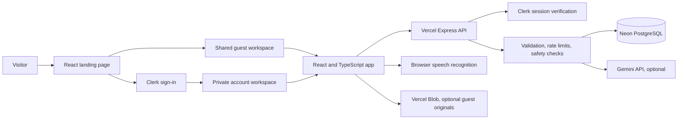

# ActionFlow AI

**Turn conversations into clear, reviewable work.** ActionFlow AI is a voice-and-text productivity workspace that extracts proposed tasks from meeting notes, connects them to relevant team context, and keeps people in control of what is saved or confirmed.

The application offers two deliberately separate experiences:

- **Guest demo:** open access to one shared, public, mutable workspace. Everyone using guest mode can see and change the same guest data. Never enter confidential or personal information here.
- **Private workspace:** Clerk sign-in provides a separate persistent workspace for each verified account. The API derives the workspace from the server-verified Clerk identity, not a user ID sent by the browser.

ActionFlow AI is intended for project teams, team leads, students, and software builders who want to organize meeting follow-ups, stand-up notes, and project discussions.

## What the application does

1. Capture speech using the browser's speech-recognition support, or enter a transcript directly.
2. Analyze the transcript with Gemini when configured, or use the built-in heuristic fallback.
3. Retrieve relevant workspace knowledge documents to provide context for analysis.
4. Present suggested tasks with owners, deadlines, priority, confidence, and supporting evidence where available.
5. Let people review and manage tasks, inspect analysis history, and export task data.
6. Apply server-side input validation and deterministic safety checks to flag consequential requests.
7. Record analysis and confirmation state in the active workspace. Confirmations are records only; the application does not execute external actions.

## Access and data behavior

| Experience | Identity | Data scope | Important note |
| --- | --- | --- | --- |
| Guest demo | No account required | One shared `guest` workspace | Public, mutable data; do not enter sensitive information. |
| Private workspace | Clerk sign-in | One workspace per verified Clerk user ID | Isolated from guest mode and other users. |

Neon PostgreSQL provides persistent hosted state. The runtime stores a versioned JSONB snapshot per workspace and uses version-checked updates to preserve concurrent changes. Local development can use JSON files; production requires Neon and fails closed rather than treating serverless disk as durable storage. The tracked `data/store.json` is not automatically imported into Neon.

## Product experience

The public landing page explains the application and offers guest demo, sign-in, and account creation paths. Signed-in users are taken to their private workspace. Guest visitors see a clear warning before entering the shared experience and another notice while using it.

Inside the workspace:

- **Voice Assistant:** record speech where supported, enter text, run analysis, review evidence, and refine results.
- **Dashboard:** view task, analysis, and review summaries.
- **Tasks:** create, update, filter, and export structured tasks.
- **Knowledge Base:** add and search workspace-scoped context; upload supported TXT, MD, and CSV files.
- **Audit Logs:** inspect workspace analysis and confirmation history. Records are capped and can be cleared; this is not an immutable compliance archive.
- **Evaluation:** compare the configured ReAct and baseline analysis flows using the included test cases.
- **Settings:** configure available analysis behavior and reset the active workspace after confirmation.

## Architecture


```mermaid
flowchart LR
    Visitor[Visitor] --> Landing[React landing page]
    Landing --> Guest[Shared guest workspace]
    Landing --> Clerk[Clerk sign-in]
    Clerk --> Private[Private account workspace]
    Guest --> Browser[React and TypeScript app]
    Private --> Browser
    Browser --> API[Vercel Express API]
    API --> Auth[Clerk session verification]
    API --> Validate[Validation, rate limits, safety checks]
    Validate --> Neon[(Neon PostgreSQL)]
    Validate --> Gemini[Gemini API, optional]
    Browser --> Speech[Browser speech recognition]
    Browser --> Blob[Vercel Blob, optional guest originals]
```

The Express API runs as a Vercel serverless function at `/api`. Frontend requests use same-origin relative `/api` routes. Clerk session tokens are sent by the client and verified by the server. The API then selects either the fixed guest scope or the verified user's scope.

### File uploads and knowledge retrieval

Supported uploads are TXT, Markdown, and CSV files up to 512 KB. Guest originals can be sent to Vercel Blob when configured; those originals are public. Signed-in uploads keep indexed text in the private workspace and do not store the original file in Blob. Workspace knowledge is limited by document count and total indexed-text size. PDF and DOCX extraction are not supported.

## Technology

- React 19, TypeScript, Vite, Tailwind CSS
- Express 4 and Node.js 20+
- Clerk for account authentication
- Neon PostgreSQL for hosted persistence and rate-limit state
- Google Gemini for optional model-backed analysis
- Vercel Blob for optional public guest file originals
- Vercel for the frontend and serverless API
- Node test runner with `tsx` for backend and validation tests

## Repository structure

```text
api/index.ts                 Vercel serverless Express entry point
server.ts                    Express routes and local server
server/db.ts                 Neon workspaces, local JSON storage, rate limits
server/validation.ts         Request and upload validation
server/guardrails.ts         Deterministic safety checks
server/gemini.ts             Gemini integration and heuristic fallback
server/prompts.ts            Model prompts
server/rag.ts                Workspace-scoped knowledge retrieval
src/main.tsx                 React entry point and Clerk setup
src/App.tsx                  Workspace state and application navigation
src/pages/LandingPage.tsx    Public product landing page
src/pages/                   Dashboard, assistant, tasks, knowledge, logs, evaluation, settings
src/services/api.ts          Same-origin API client
db/schema.sql                Runtime Neon schema reference
vercel.json                  Build, API rewrite, SPA fallback, and response headers
DEPLOYMENT_GUIDE.md          Step-by-step Vercel and provider setup
PRODUCTION_CHECKLIST.md       Preview and production verification checklist
```

## Run and verify locally

Requirements: Node.js 20 or newer and npm.

```bash
npm ci
npm run dev
```

The local application is served at `http://localhost:3000`. To run the project checks and production build:

```bash
npm run lint
npm test
npm run build:client
npm run build
```

`npm test` runs the input/guardrail, workspace persistence and isolation, concurrency, storage-limit, confirmation, and API validation tests.

### Environment variables

Use a local `.env` file for local configuration. Never commit it. Configure deployment secrets in Vercel's encrypted environment settings and keep Preview and Production values/data appropriately separated.

| Variable | Purpose |
| --- | --- |
| `DATABASE_URL` | Neon PostgreSQL connection string; required for durable production storage. |
| `VITE_CLERK_PUBLISHABLE_KEY` | Public Clerk key embedded in the browser bundle. |
| `CLERK_PUBLISHABLE_KEY` | Clerk publishable key used by the server. Must match the browser key. |
| `CLERK_SECRET_KEY` | Server-only Clerk secret. Required with both publishable-key settings for private accounts. |
| `GEMINI_API_KEY` | Optional server-side Gemini access. The heuristic analyzer is used when not configured. |
| `BLOB_READ_WRITE_TOKEN` | Optional Vercel Blob access for public guest originals. |
| `PORT` | Local server port; defaults to `3000`. |
| `DATA_DIR`, `DB_FILE` | Optional paths for local JSON persistence. |

For a deployment with both guest mode and private accounts, configure all three Clerk variables together and configure `DATABASE_URL`. Partial Clerk configuration causes API requests to fail rather than silently selecting an unintended workspace. Do not prefix server secrets with `VITE_`.

## Deployment

Deploy the frontend and API together as one Vercel project. Use the repository's Vercel settings: `npm run build:client` and output directory `dist`; `vercel.json` routes `/api/*` to the serverless API and other paths to the single-page application.

Before Production, verify the Preview deployment with the actual provider accounts: guest access and warning, Clerk sign-in, two-user isolation, persistence after refresh and a later function instance, `/api/health`, and any enabled Gemini or Blob flows. The health endpoint reports configuration/readiness signals but does not replace real read/write and isolation tests.

See [`DEPLOYMENT_GUIDE.md`](DEPLOYMENT_GUIDE.md) for the detailed setup, provider configuration, troubleshooting, rollback, and update process. Use [`PRODUCTION_CHECKLIST.md`](PRODUCTION_CHECKLIST.md) to track verification.

## Security and product boundaries

- Private workspace selection uses the verified Clerk user ID; browser-supplied identity does not authorize access.
- Guest data is intentionally public and shared. Guest uploads may store public originals in Blob.
- Gemini and database credentials remain server-side.
- API inputs, editable task fields, upload types/paths, and public Blob URLs are validated.
- Request limits and storage caps help bound abuse and workspace growth; public services still require monitoring and provider usage controls.
- Transcripts, refinements, and retrieved documents are treated as untrusted model input. Deterministic server-side rules supplement model output.
- Confirmation dialogs record a decision in workspace history; they do not trigger payments, emails, deletions, or other external effects.
- Audit history is workspace-scoped and capped, but users can clear it. Do not present it as tamper-proof or regulatory compliance storage.

## Known limitations

- Speech recognition depends on browser support and microphone permission; text entry is available as an alternative.
- PDF and DOCX uploads are not supported.
- Private file originals are not stored; signed-in uploads retain indexed text only.
- Guest data and guest Blob originals are public by design.
- The Neon runtime uses versioned JSONB workspace snapshots rather than normalized per-entity tables.
- Public guest access can be abused across multiple IP addresses; monitor usage and set provider spending controls.
- The production JavaScript bundle currently emits a size advisory; this does not prevent a successful build.

## API overview

| Route | Methods | Purpose |
| --- | --- | --- |
| `/api/health` | `GET` | Safe integration and database readiness status. |
| `/api/session` | `GET` | Report the active workspace mode. |
| `/api/analyze`, `/api/refine` | `POST` | Analyze or refine a transcript result. |
| `/api/tasks` | `GET`, `POST` | Read or create workspace tasks. |
| `/api/tasks/:id` | `PATCH`, `DELETE` | Update or remove a workspace task. |
| `/api/knowledge` | `GET`, `POST` | Read or add indexed knowledge. |
| `/api/knowledge/search` | `POST` | Search workspace knowledge. |
| `/api/knowledge/upload-token` | `POST` | Request a constrained guest Blob upload token. |
| `/api/audit-logs` | `GET`, `DELETE` | Read or clear workspace audit history. |
| `/api/execute-action` | `POST` | Record confirmation or cancellation; no external side effect. |
| `/api/evaluation/cases`, `/api/evaluate` | `GET`, `POST` | Read benchmark cases or run an evaluation. |
| `/api/settings` | `GET`, `PATCH` | Read or update workspace settings. |
| `/api/reset` | `POST` | Restore the active workspace's built-in demo state. |

## Project summary

ActionFlow AI demonstrates an end-to-end responsible-AI workflow: browser-based voice or text input, grounded task extraction, reviewable evidence, deterministic safety checks, workspace-scoped history, authenticated data isolation, persistent storage, and a deployable Vercel architecture. It is an educational and productivity application; model suggestions should be reviewed by a person before being used for consequential decisions.
