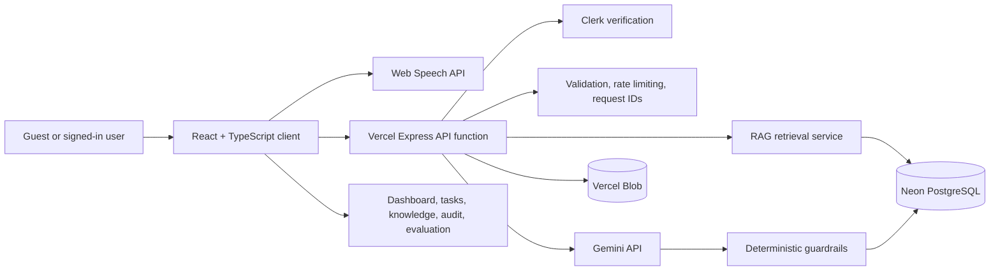
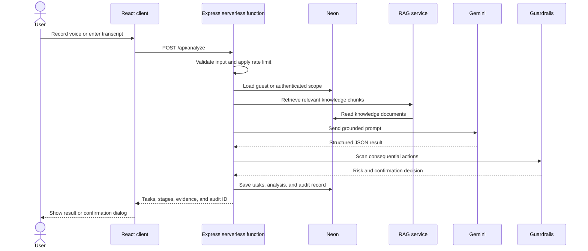
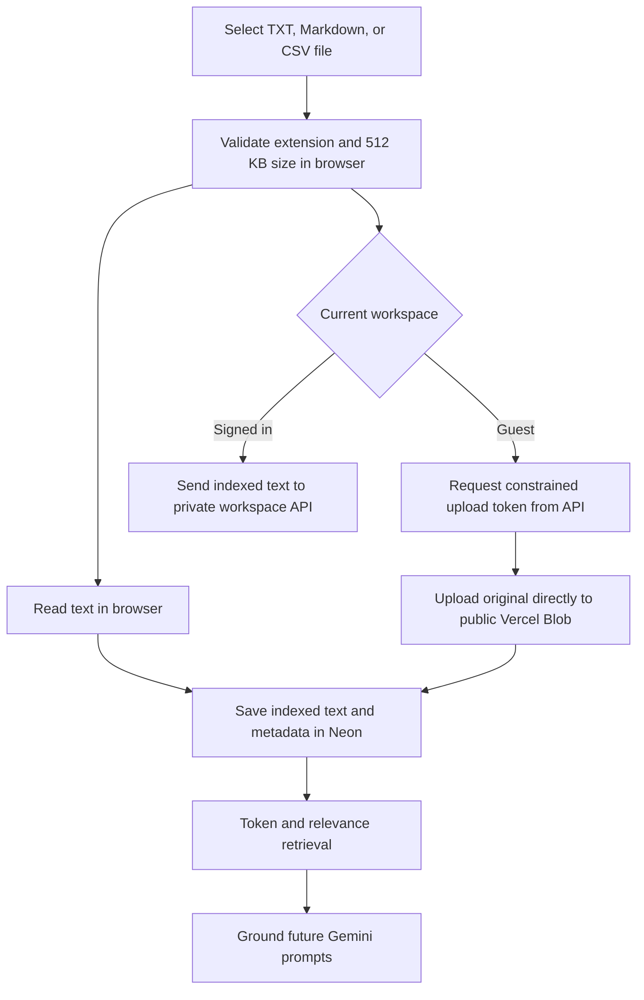
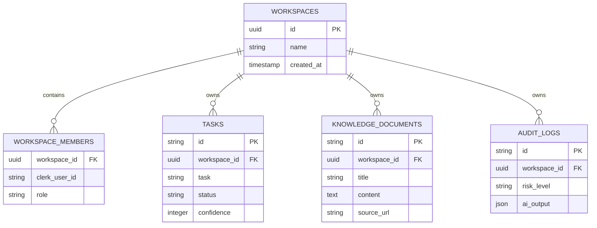

# ActionFlow AI

> ReAct Productivity Agent that turns conversations into accountable action with grounded AI, deterministic safety guardrails, human review, and complete auditability.

---

## Table of Contents
1. [Overview](#overview)
2. [How It Works](#how-it-works)
3. [Core Architecture & Capabilities](#core-architecture--capabilities)
   - [1. Real-Time Speech Recognition & Microphone Permissions](#1-real-time-speech-recognition--microphone-permissions)
   - [2. Multi-Stage Reasoning Workflow (ReAct Framework)](#2-multi-stage-reasoning-workflow-react-framework)
   - [3. Grounded Context & Internal Knowledge Base](#3-grounded-context--internal-knowledge-base)
   - [4. Guardrails & Consequential Action Detection](#4-guardrails--consequential-action-detection)
   - [5. Task Management System](#5-task-management-system)
   - [6. Audit Trail & Compliance Logging](#6-audit-trail--compliance-logging)
   - [7. Benchmark Evaluation Suite (ReAct vs. Baseline)](#7-benchmark-evaluation-suite-react-vs-baseline)
4. [Technology Stack](#technology-stack)
5. [High-Level Architecture](#high-level-architecture)
6. [System Architecture](#system-architecture)
7. [API Reference](#api-reference)
7. [Getting Started & Local Development](#getting-started--local-development)
8. [Configuration & Environment Variables](#configuration--environment-variables)
9. [Safety & Security Highlights](#safety--security-highlights)
10. [Vercel Deployment](#vercel-deployment)
11. [Database Design](#database-design)
12. [Limitations and Roadmap](#limitations-and-roadmap)
13. [Resume-Ready Project Summary](#resume-ready-project-summary)

---

## Overview

In day-to-day engineering and product operations, action items from standups, planning calls, or quick voice memos often get lost in ambiguous language, unassigned owners, or missing deadlines. 

The **AI Voice-to-Action Assistant** bridges this gap:
- **Listens** to real-time speech or accepts written transcripts.
- **Understands** context using internal team directories, project documents, and role definitions.
- **Structures** speech into granular tasks with owners, deadlines, priority levels, confidence scores, and verbatim evidence.
- **Protects** against unauthorized or consequential actions (e.g. money transfers, account deletions, credential leaks) through server-authoritative guardrails.
- **Audits** every extraction with full model traceability, execution latencies, and human decision records.

---

## How It Works

```
[User Audio / Transcript]
           │
           ▼
[Microphone Permission Check & Web Speech API]
           │
           ▼
[Section 9: Input Validation & Sanitization]
           │
           ▼
[Section 22: Context Retrieval & Document Grounding]
           │
           ▼
[ReAct Multi-Stage Reasoning (Gemini API)]
 ├─ Stage 1: Input received
 ├─ Stage 2: Integrity & length validation
 ├─ Stage 3: Semantic understanding & intent detection
 ├─ Stage 4: Grounded context matching
 ├─ Stage 5: Structured task extraction & synthesis
 ├─ Stage 6: Safety check & consequential action scan
 └─ Stage 7: Schema verification & presentation
           │
           ▼
[Section 15 & 16: Guardrail Evaluation]
 ├─ Low Risk    ──► Direct display in Task Board & Dashboard
 └─ High Risk   ──► Halts execution & triggers Human Confirmation Dialog
           │
           ▼
[Section 23: Complete Audit Log Persisted to Storage]
```

1. **Permission Check & Capture**: When you click the microphone button, the app explicitly asks for microphone permission via both the Web Audio/MediaDevices API and a dedicated confirmation prompt. Speech is transcribed in real-time.
2. **Context Grounding**: The assistant scans internal project files (e.g., `team_members.txt`, `project_guidelines.txt`) to correctly associate ambiguous references like *"I"* or *"assign frontend to the lead"* to the correct team member (e.g., Siddharth Kumar, Rahul Sharma).
3. **Structured Extraction**: Gemini extracts action items, estimates realistic priority and deadline metadata, and isolates specific assumptions and uncertainties.
4. **Safety & Risk Assessment**: If high-risk verbs (e.g., *transfer funds*, *delete table*, *reveal password*) are present, the app flags the output as `HIGH` or `MEDIUM` risk and displays a pending action card. Confirm/Cancel records a workspace-scoped decision only; this app does not execute external actions.
5. **Workspace Audit History**: Each analysis, transcript, model output, and confirmation state is stored in the active workspace. Audit history is capped, can be cleared by that workspace, and is not an immutable compliance archive.

---

## Core Architecture & Capabilities

### 1. Real-Time Speech Recognition & Microphone Permissions
- **User-Consent Flow**: Explicitly requests microphone authorization (`navigator.mediaDevices.getUserMedia` and Web Speech API).
- **Graceful Fallbacks**: If access is denied or unavailable, users are clearly informed how to enable permissions or switch seamlessly to manual text input.
- **Live Interim Feedback**: Words stream directly onto the screen as they are spoken, allowing users to review and manually edit before triggering analysis.

### 2. Multi-Stage Reasoning Workflow (ReAct Framework)
Unlike simple zero-shot prompts, the assistant utilizes a structured Reason + Act (ReAct) workflow:
- **Observation & Decomposition**: Analyzes sentences, entities, and temporal markers (e.g., *"by Friday"*, *"next Tuesday"*).
- **Assumptions vs. Uncertainties**: Explicitly lists what was assumed (e.g., current sprint dates) vs. what remains ambiguous (e.g., unstated meeting times).
- **Verbatim Evidence Linking**: Each generated task links directly back to the exact quote in the transcript that justified it.

### 3. Grounded Context & Internal Knowledge Base
- **Document Management**: Built-in Knowledge Base stores project guidelines, team member roles, and company policies.
- **Dynamic Retrieval**: Queries are evaluated against documents to retrieve relevant excerpts with confidence relevance scores.
- **Entity Disambiguation**: Resolves pronouns and roles to real names and titles without hallucination.

### 4. Guardrails & Consequential Action Detection
- **Multi-Category Scanning**:
  - **Financial**: Money transfers, payouts, vendor payments, disbursements.
  - **Deletion / Destruction**: Database drops, user purges, log deletions, file removals.
  - **Security & Access**: Credential retrieval, role elevation, private keys, admin grants.
  - **External Communication**: Broadcast emails, newsletters, contract dispatch.
- **Server-Authoritative Enforcement**: Even if client inputs attempt to bypass the model, backend guardrail rules enforce `HIGH` risk tagging and mandatory confirmation.

### 5. Task Management System
- **Interactive Kanban / Table**: Filter tasks by status (`Pending`, `In Progress`, `Completed`), priority, or owner.
- **Inline Editing & Quick Add**: Modify task descriptions, reassign owners, or set deadlines on the fly.
- **Export Capabilities**: Export entire task lists or individual analyses to structured JSON and CSV.

### 6. Audit Trail & Compliance Logging
- **Scoped Audit Log Store**: Records timestamps, prompt versions, input source, model, and AI output within the current workspace. Users can clear records from their workspace; this is not an immutable compliance archive.
- **Confirmation State Tracking**: Tracks whether proposed high-risk actions were `CONFIRMED`, `CANCELLED`, or marked `NOT_REQUIRED`.
- **Deep Inspection Drawer**: Inspect raw JSON payloads, reasoning stages, and context grounding scores for any past transaction.

### 7. Benchmark Evaluation Suite (ReAct vs. Baseline)
- **Side-by-Side Comparison**: Pre-configured test cases evaluate the ReAct reasoning pipeline against naive single-prompt baseline extraction.
- **Metrics Evaluated**:
  - Task Extraction Accuracy (%)
  - Ambiguity Detection Rate (%)
  - Guardrail & Safety Compliance (%)
  - Owner Attribution Precision (%)

---

## Technology Stack

- **Frontend**:
  - React 19 with TypeScript
  - Tailwind CSS (v4)
  - Lucide React (Icons)
  - Motion (Fluid animations)
  - Web Speech API & MediaDevices API
- **Backend**:
  - Express 4.x running as a Vercel serverless function
  - `@google/genai` for Gemini analysis and refinement
  - Neon PostgreSQL for hosted persistence and user-scoped state
  - Vercel Blob for public guest knowledge-base originals; signed-in uploads retain indexed text only.
  - Clerk for verified private identity scopes; the production guest-plus-private product requires Clerk credentials
  - Local JSON persistence fallback for development
- **Build and deployment**:
  - Vite 6 + esbuild
  - Vercel static output plus `/api` serverless routing
  - TypeScript checks and Node-based guardrail regression tests

---

## High-Level Architecture


```mermaid
flowchart LR
    User[Guest or signed-in user] --> Browser[React + TypeScript client]
    Browser --> Voice[Web Speech API]
    Browser --> API[Vercel Express API function]
    API --> Auth[Clerk verification]
    API --> Guard[Validation, rate limiting, request IDs]
    API --> RAG[RAG retrieval service]
    RAG --> Neon[(Neon PostgreSQL)]
    API --> Gemini[Gemini API]
    Gemini --> Safety[Deterministic guardrails]
    Safety --> Neon
    API --> Blob[(Vercel Blob)]
    Browser --> UI[Dashboard, tasks, knowledge, audit, evaluation]
```

## Analysis Request Flow


```mermaid
sequenceDiagram
    actor User
    participant UI as React client
    participant API as Express serverless function
    participant DB as Neon
    participant RAG as RAG service
    participant AI as Gemini
    participant Guard as Guardrails

    User->>UI: Record voice or enter transcript
    UI->>API: POST /api/analyze
    API->>API: Validate input and apply rate limit
    API->>DB: Load guest or authenticated scope
    API->>RAG: Retrieve relevant knowledge chunks
    RAG->>DB: Read knowledge documents
    API->>AI: Send grounded prompt
    AI-->>API: Structured JSON result
    API->>Guard: Scan consequential actions
    Guard-->>API: Risk and confirmation decision
    API->>DB: Save tasks, analysis, and audit record
    API-->>UI: Tasks, stages, evidence, and audit ID
    UI-->>User: Show result or confirmation dialog
```

## Upload and RAG Flow


```mermaid
flowchart TD
    Select[Select TXT, Markdown, or CSV file] --> Limit[Validate extension and 512 KB size in browser]
    Limit --> Extract[Read text in browser]
    Limit --> Workspace{Current workspace}
    Workspace -->|Guest| Token[Request constrained upload token from API]
    Token --> Blob[Upload original directly to public Vercel Blob]
    Workspace -->|Signed in| PrivateText[Send indexed text to private workspace API]
    Extract --> Save[Save indexed text and metadata in Neon]
    Blob --> Save
    Save --> Retrieve[Token and relevance retrieval]
    Retrieve --> Prompt[Ground future Gemini prompts]
```

## System Architecture

```
/
├── api/index.ts               # Vercel serverless Express entry point
├── server.ts                  # Express routes and local development server
├── server/
│   ├── db.ts                  # Neon JSONB workspaces, local development storage, and rate limits
│   ├── validation.ts          # API task, audit-filter, and upload URL/path validation
│   ├── gemini.ts              # Server-only Gemini integration, parsing, and heuristic fallback
│   ├── prompts.ts             # System instructions and prompt templates
│   ├── rag.ts                 # Workspace-scoped knowledge retrieval
│   └── guardrails.ts          # Server-side safety checks for consequential requests
├── src/
│   ├── App.tsx                # Main application state, navigation, and API coordination
│   ├── main.tsx               # Client React DOM entry point
│   ├── types.ts               # Shared TypeScript schemas, interfaces, and enums
│   ├── components/
│   │   ├── Navigation.tsx     # App header and tab switcher
│   │   ├── VoiceRecorder.tsx  # Mic permissions, Web Speech recording & interim transcript
│   │   ├── ProcessingWorkflow.tsx # Visual progress stepper for reasoning stages
│   │   ├── ResultDisplay.tsx  # Task cards, evidence accordion, refinement & export
│   │   ├── ConfirmationDialog.tsx # High-risk human confirmation modal
│   │   └── GroundedSourceCard.tsx # Grounded knowledge base citations
│   └── pages/
│       ├── DashboardPage.tsx      # Overview metrics & synchronized recent analyses
│       ├── VoiceAssistantPage.tsx # Core voice & text input interface
│       ├── TasksPage.tsx          # Task management, filters & status updates
│       ├── KnowledgeBasePage.tsx  # Internal document search & management
│       ├── AuditLogsPage.tsx      # Full audit history & inspection
│       ├── EvaluationPage.tsx     # ReAct vs. Baseline benchmark runner
│       └── SettingsPage.tsx       # Model selection, grounding toggles & system diagnostics
└── metadata.json              # Platform capabilities and microphone permissions
```

---

## API Reference

| Endpoint | Method | Description |
| :--- | :---: | :--- |
| `/api/health` | `GET` | Safe dependency configuration and database readiness status |
| `/api/stats` | `GET` | Dashboard metrics |
| `/api/analyze` | `POST` | Analyze a transcript with grounded AI |
| `/api/refine` | `POST` | Refine an existing AI result |
| `/api/execute-action` | `POST` | Record confirmation or cancellation; no external side effect |
| `/api/tasks` | `GET/POST` | List or create tasks |
| `/api/tasks/:id` | `PATCH/DELETE` | Update or delete a task |
| `/api/analyses` | `GET` | List recent analyses |
| `/api/audit-logs` | `GET/DELETE` | Read or clear audit records |
| `/api/knowledge` | `GET/POST` | List or create indexed knowledge documents |
| `/api/session` | `GET` | Identify public or private workspace mode |
| `/api/knowledge/upload-token` | `POST` | Generate a scoped token for direct guest Blob upload |
| `/api/knowledge/:id` | `DELETE` | Delete a knowledge document |
| `/api/knowledge/search` | `POST` | Search grounded knowledge chunks |
| `/api/evaluation/cases` | `GET` | List benchmark cases |
| `/api/evaluate` | `POST` | Run a benchmark comparison |
| `/api/settings` | `GET/PATCH` | Read or update assistant settings |
| `/api/reset` | `POST` | Restore demo data after explicit confirmation |

---

## Getting Started & Local Development

### Prerequisites
- Node.js 20+
- npm

### Installation
1. Open the project folder.
2. Install the exact locked dependencies:
   ```bash
   npm ci
   ```

3. Configure environment variables (see below).

4. Start the development server:
   ```bash
   npm run dev
   ```
   The application will be accessible at `http://localhost:3000`.

5. Run checks and build:
   ```bash
   npm run lint
   npm test
   npm run build
   ```

---

---

## Safety & Security Highlights

1. **Human-in-the-Loop Safeguards**: High-risk financial, security, or data modification tasks cannot execute autonomously. They generate an interactive confirmation dialog with audit logging.
2. **Audio Privacy**: Speech recognition is executed locally via browser APIs. Audio streams are terminated immediately upon stopping recording.
3. **Defense-in-Depth Risk Analysis**: High-risk detection uses both deep semantic LLM evaluation and deterministic regular-expression rule matching.
4. **Transparent Citations**: Every piece of extracted metadata cites its source sentence from the user's transcript or knowledge base document.

## Vercel Deployment

1. Import the reviewed GitHub repository into Vercel from its root directory.
2. Use the Vite build command `npm run build:client` and output directory `dist`; `vercel.json` contains these settings.
3. Add the production environment variables described below.
4. Deploy a preview, then test guest mode, Clerk isolation, database persistence, Gemini, and uploads before sharing the production deployment.
5. Use `/api/health` to check safe dependency status; `database.persistent: true` is stronger evidence than the configured storage label, but still test a real write and read.

See [`DEPLOYMENT_GUIDE.md`](DEPLOYMENT_GUIDE.md) for the full beginner-friendly sequence and troubleshooting instructions. The project serves the frontend and `/api/*` from one Vercel project.

## Environment Variables

Use `.env` for local development and configure the same values in the hosting provider's encrypted environment settings for deployment. Never commit `.env` or place server secrets in frontend code.

```env
# Required for the full production guest + private-account product. Set all three together.
VITE_CLERK_PUBLISHABLE_KEY=
CLERK_PUBLISHABLE_KEY=
CLERK_SECRET_KEY=

# Neon is required for durable production persistence
DATABASE_URL=

# Optional integrations
GEMINI_API_KEY=
BLOB_READ_WRITE_TOKEN=

# Local development settings
PORT=3000
NODE_ENV=development
DATA_DIR=./data
DB_FILE=./data/local-store.json
```

Configuration behavior:

- Leave all Clerk keys blank for guest-only local development. The intended production deployment requires all three Clerk keys so private accounts are available alongside guest mode.
- Configure all Clerk keys together to enable verified server-side private user scopes. Partial Clerk configuration rejects API requests.
- Without `DATABASE_URL`, local development uses JSON files; production startup fails rather than silently using ephemeral storage.
- Without `BLOB_READ_WRITE_TOKEN`, text documents still work, but guest Blob uploads are unavailable.
- Without `GEMINI_API_KEY`, the heuristic analyzer remains available.
- Guest uploads are direct-to-Blob and public (TXT, MD, CSV, up to 512 KB). Signed-in uploads index text only and do not upload originals. Never upload confidential guest files.

## Database Design

The runtime stores a JSONB workspace snapshot per fixed `guest` scope or verified Clerk user ID in Neon. Mutations use version-checked updates and are awaited before success responses. Neon is required for durable production operation; local development can use JSON files.

`db/schema.sql` documents the runtime `app_state` and `api_rate_limits` tables. The server applies those idempotent definitions at startup, including the `version` column and rate-limit cleanup index. `db/normalized-schema.sql` is an unused next-stage relational design; do not apply it to this runtime deployment.


```mermaid
erDiagram
    WORKSPACES ||--o{ WORKSPACE_MEMBERS : contains
    WORKSPACES ||--o{ TASKS : owns
    WORKSPACES ||--o{ KNOWLEDGE_DOCUMENTS : owns
    WORKSPACES ||--o{ AUDIT_LOGS : owns

    WORKSPACES {
        uuid id PK
        string name
        timestamp created_at
    }
    WORKSPACE_MEMBERS {
        uuid workspace_id FK
        string clerk_user_id
        string role
    }
    TASKS {
        string id PK
        uuid workspace_id FK
        string task
        string status
        integer confidence
    }
    KNOWLEDGE_DOCUMENTS {
        string id PK
        uuid workspace_id FK
        string title
        text content
        string source_url
    }
    AUDIT_LOGS {
        string id PK
        uuid workspace_id FK
        string risk_level
        json ai_output
    }
```

## Safety and Security Model

- Gemini and database credentials remain server-side.
- Clerk sessions are verified server-side when configured; the server selects private scope from the verified identity, never a browser-supplied user ID.
- Guest mode intentionally shares public data; signed-in users have distinct scopes.
- Expensive guest AI and upload-token requests use Neon-backed per-IP rate limits; authenticated requests are limited per verified identity.
- Guest Blob uploads are limited to text formats up to 512 KB; originals are public. Private uploads store indexed text only.
- High-risk actions are recorded for confirmation but never executed externally.
- Prompt content is treated as untrusted input; prompts separate transcript/document data from system instructions, and deterministic guardrails run server-side.
- Request IDs and latency logs support debugging and incident tracing.

## Testing and Quality Checks

```bash
npm run lint
npm test
npm run build:client
npm run build
```

The automated suite covers input validation, risk detection, shared guest persistence, and isolation between private users and guest state. The production build compiles both the Vite client and Express server bundle.

### Deployment Readiness Verification

Validation performed during this update:

| Check | Result | Notes |
| :--- | :---: | :--- |
| TypeScript check (`npm run lint`) | PASS | Completed without TypeScript errors. |
| Automated tests (`npm test`) | PASS | 6 tests passed, including guest persistence and private-scope isolation using local storage. |
| Frontend build (`npm run build:client`) | PASS | Vite reported a large-chunk advisory. |
| Full build (`npm run build`) | PASS | Vite reported the same advisory; the server bundle was produced. |
| Live browser/API smoke test | NOT RUN | Local server startup/testing was blocked by workspace command policy. |
| Real Clerk/Neon/Blob deployment | NOT RUN | Requires provider accounts and credentials. |

These checks do not prove real Neon concurrency, Clerk production-domain behavior, Gemini calls, or Blob uploads. Complete the integration and isolation checklist in [`DEPLOYMENT_GUIDE.md`](DEPLOYMENT_GUIDE.md) before treating the app as production-ready.

## Limitations and Roadmap

- PDF and DOCX extraction require a document parser.
- The compatibility JSONB snapshot should eventually be replaced with relational repository queries from `db/normalized-schema.sql`.
- Production API and expensive-operation limits use Neon when configured. Local JSON development falls back to process-local limits. Public guest access remains abuseable across many IP addresses; monitor usage and set provider spending controls.
- Production deployments should add centralized error tracking and retained structured logs.
- Browser end-to-end tests should cover the complete guest and authenticated journeys.

## Resume-Ready Project Summary

> Built a serverless responsible-AI task orchestration platform that converts voice conversations into grounded, explainable, and auditable action plans. Implemented Gemini structured extraction, RAG retrieval, deterministic safety guardrails, human-in-the-loop confirmation, Clerk identity scopes, Neon persistence, Vercel Blob uploads, benchmark evaluation, request observability, and Vercel deployment.
